# L04: Ready, Set, Stop That Threat!

**Course:** Cybersecurity Threat Modeling Lab  
**Lab:** L04 – Threat Modeling Analysis  
**Student:** [Your Name]  
**Date:** January 2025 (America/Los_Angeles)  
**License:** ©2025 Richard Zins CC BY-NC-SA 4.0

---

## Task 1: Choose Some Software (1 Point)

**Project Name:** WordPress

**Description:**
WordPress is the world's most popular open-source content management system (CMS) built in PHP, using MySQL or MariaDB for data storage. It powers over 40% of all websites, offering a plugin-based architecture and theme customization. Typical deployments use the LAMP stack (Linux, Apache/Nginx, MySQL, PHP). The platform handles user authentication, media uploads, and dynamic content rendering through a mix of REST API and server-side processing. WordPress's ecosystem, with numerous plugins and themes, presents real-world opportunities to identify security boundaries, threats, and mitigations.

**Official Repository:**
https://github.com/WordPress/WordPress

---

## Task 2: Data Flow Diagram (DFD) (3 Points)

### Boundaries Used
- **1. Environment Boundary:** Separates the public Internet from the Web Server (main entry point for users).
- **2. Data Boundary:** Separates the WordPress Application Layer from the MySQL Database (trusted internal data zone).

### DFD Rationale
- **Two Trust Boundaries** highlight key attack surfaces: external access and data handling.
- **Five Data Flows** show the major system interactions — page request and content retrieval.
- **Threat Modeling Shapes:**
  - External Entities → User, Admin
  - Processes → Web Server, WordPress Application
  - Data Store → MySQL Database
  - Trust Boundaries → Environment + Data
  - Data Flows → HTTPS requests, SQL queries

### DFD Explanation
1. **User/Admin → Web Server (HTTPS Request)**
   - Web traffic enters through TLS, representing external interactions crossing the environment boundary.
2. **Web Server → WordPress Application (Internal HTTP/PHP Processing)**
   - Internal communication for page generation or plugin execution.
3. **WordPress Application → MySQL Database (SQL Query)**
   - Application queries or stores post/user data (crosses data boundary).
4. **MySQL Database → WordPress Application (SQL Response)**
   - Data returned securely within the trusted internal zone.
5. **WordPress Application → Web Server → User/Admin (HTTPS Response)**
   - The final rendered page or dashboard view is sent back.

### DFD Diagram

### Draw.io Construction Guide
- **External Entities:** "User Browser", "Admin Dashboard"
- **Processes:** "Web Server", "WordPress Core Application"
- **Data Store:** "MySQL Database"
- **Boundaries:**
  - "Environment Boundary: Internet to Web Server"
  - "Data Boundary: Application to Database"
- **Data Flows (with arrows):**
  - HTTPS Requests (GET/POST)
  - SQL Queries (SELECT/INSERT)
- **Label boundaries with dashed orange/red lines.**

---

## Task 3: Threat Tree Diagram (TTD) (3 Points)

### Root Threat
**"Compromise of WordPress Website Integrity and User Data"**

### Vulnerabilities
1. **Weak Authentication** – Weak passwords or missing 2FA allow brute-force attacks.
2. **SQL Injection** – Improperly sanitized input in plugins/themes.
3. **Cross-Site Scripting (XSS)** – User input not properly escaped in pages or comments.

### Countermeasures
1. **Strong Password Policy & 2FA** – Enforce complex passwords and MFA.
2. **Parameterized Queries & ORM Use** – Prevent SQLi by avoiding dynamic queries.
3. **Input Sanitization & CSP Headers** – Prevent XSS and injected script execution.

### TTD Diagram

```mermaid
graph TD
    %% Root Threat
    Root["🔥 Compromise of WordPress<br/>Website Integrity and User Data<br/>(Root Threat)"]
    
    %% Level 1 - Vulnerabilities
    WeakAuth["🔐 Weak Authentication<br/>(Vulnerability)"]
    SQLInj["💉 SQL Injection<br/>(Vulnerability)"]
    XSS["🌐 Cross-Site Scripting (XSS)<br/>(Vulnerability)"]
    
    %% Level 2 - Specific Attack Methods
    BruteForce["💥 Brute Force Attacks<br/>(Attack Method)"]
    PluginSQLi["🔌 Plugin SQL Injection<br/>(Attack Method)"]
    CommentXSS["💬 Comment XSS Injection<br/>(Attack Method)"]
    
    %% Countermeasures
    MFA["🔒 Multi-Factor Authentication<br/>(Countermeasure)"]
    ParamQueries["📝 Parameterized Queries<br/>(Countermeasure)"]
    InputSanit["🧹 Input Sanitization<br/>(Countermeasure)"]
    CSP["🛡️ Content Security Policy<br/>(Countermeasure)"]
    
    %% Connections - Root to Vulnerabilities
    Root --> WeakAuth
    Root --> SQLInj
    Root --> XSS
    
    %% Connections - Vulnerabilities to Attack Methods
    WeakAuth --> BruteForce
    SQLInj --> PluginSQLi
    XSS --> CommentXSS
    
    %% Countermeasures mapped to vulnerabilities
    MFA -.->|"Mitigates"| WeakAuth
    ParamQueries -.->|"Mitigates"| SQLInj
    InputSanit -.->|"Mitigates"| XSS
    CSP -.->|"Mitigates"| XSS
    
    %% Styling
    classDef root fill:#ffebee,stroke:#f44336,stroke-width:4px
    classDef vulnerability fill:#fff3e0,stroke:#ff9800,stroke-width:2px
    classDef attack fill:#f3e5f5,stroke:#9c27b0,stroke-width:2px
    classDef countermeasure fill:#e8f5e8,stroke:#4caf50,stroke-width:2px
    
    class Root root
    class WeakAuth,SQLInj,XSS vulnerability
    class BruteForce,PluginSQLi,CommentXSS attack
    class MFA,ParamQueries,InputSanit,CSP countermeasure
```

### TTD Structure for draw.io
- **Root Node:** Compromise of WordPress Site
- **Child Nodes (Vulnerabilities):**
  - Weak Authentication
  - SQL Injection
  - Cross-Site Scripting (XSS)
- **Countermeasure Branches:**
  - MFA + Password Policy
  - Parameterized Queries
  - Input Validation + Content Security Policy

### Rationale
- **At least 3 vulnerabilities and 3 countermeasures.**
- **Uses threat tree symbols (root → branches → leaf nodes).**
- **Follows OWASP recommendations for web app threats.**

---

## Task 4: Use & Misuse Diagram (UMD) (3 Points)

### Use Cases (Legitimate)
1. **User Logs Into Account** – Authenticates through the login form.
2. **Admin Publishes a Post** – Uses dashboard to upload and edit content.
3. **User Comments on a Post** – Interacts with front-end commenting feature.

### Misuse Cases (Attacks)
1. **Credential Stuffing Attack** – Attacker attempts login with stolen credentials.
2. **Malicious File Upload** – Attacker uploads a malicious plugin or media file.
3. **Comment XSS Injection** – Attacker posts a script in a comment field.

### Mitigations
1. **Rate Limiting & MFA** → Protects against Credential Stuffing.
2. **File Type Validation & Security Plugins** → Stops Malicious Uploads.
3. **Input Sanitization & Output Encoding** → Prevents XSS Injection.

### UMD Diagram

```mermaid
graph TB
    %% Actors
    User[("👤 User<br/>(Actor)")]
    Admin[("👑 Admin<br/>(Actor)")]
    Attacker[("⚠️ Malicious Attacker<br/>(Actor)")]
    
    %% Use Cases
    UserLogin["🔐 User Logs Into Account<br/>(Use Case)"]
    AdminPost["✍️ Admin Publishes a Post<br/>(Use Case)"]
    UserComment["💬 User Comments on a Post<br/>(Use Case)"]
    
    %% Misuse Cases
    CredentialStuffing["💀 Credential Stuffing Attack<br/>(Misuse Case)"]
    MaliciousUpload["☠️ Malicious File Upload<br/>(Misuse Case)"]
    CommentXSS["🕷️ Comment XSS Injection<br/>(Misuse Case)"]
    
    %% Mitigations
    RateLimit["🚦 Rate Limiting & MFA<br/>(Mitigation)"]
    FileValidation["✅ File Type Validation<br/>(Mitigation)"]
    InputSanit["🧹 Input Sanitization<br/>(Mitigation)"]
    
    %% Legitimate Actor Connections
    User --> UserLogin
    User --> UserComment
    Admin --> AdminPost
    
    %% Threaten Connections (Red dashed lines)
    CredentialStuffing -.->|"🚫 THREATENS"| UserLogin
    MaliciousUpload -.->|"🚫 THREATENS"| AdminPost
    CommentXSS -.->|"🚫 THREATENS"| UserComment
    
    %% Attacker to Misuse Cases
    Attacker --> CredentialStuffing
    Attacker --> MaliciousUpload
    Attacker --> CommentXSS
    
    %% Mitigation Connections (Green solid lines)
    RateLimit -->|"✅ MITIGATES"| CredentialStuffing
    FileValidation -->|"✅ MITIGATES"| MaliciousUpload
    InputSanit -->|"✅ MITIGATES"| CommentXSS
    
    %% Legend
    subgraph Legend ["📋 Legend"]
        Threaten["🚫 THREATENS<br/>(Dashed Red Line)"]
        Mitigates["✅ MITIGATES<br/>(Solid Green Line)"]
        Normal["➡️ NORMAL FLOW<br/>(Solid Blue Line)"]
    end
    
    %% Styling
    classDef actor fill:#e3f2fd,stroke:#2196f3,stroke-width:2px
    classDef usecase fill:#e8f5e8,stroke:#4caf50,stroke-width:2px
    classDef misuse fill:#ffebee,stroke:#f44336,stroke-width:2px
    classDef mitigation fill:#fff3e0,stroke:#ff9800,stroke-width:2px
    classDef legend fill:#f5f5f5,stroke:#9e9e9e,stroke-width:1px
    
    class User,Admin,Attacker actor
    class UserLogin,AdminPost,UserComment usecase
    class CredentialStuffing,MaliciousUpload,CommentXSS misuse
    class RateLimit,FileValidation,InputSanit mitigation
    class Legend legend
```

### UMD Structure for draw.io
- **Actors:**
  - User
  - Admin
  - Attacker
- **Connections:**
  - "Threaten" (Red Dashed Line): Misuse → Use Case
  - "Mitigate" (Green Solid Line): Mitigation → Misuse
- **Include Legend Box:**
  - Dashed Red → Threaten
  - Green Solid → Mitigate
  - Blue Solid → Normal Use

### Rationale
- **Includes 3 use cases, 3 misuse cases, and corresponding mitigations.**
- **Explicit "Threaten" and "Mitigation" links satisfy full-credit criteria.**
- **Represents realistic WordPress attacker and defender scenarios.**

---

## References

- OWASP Threat Modeling Guide – https://owasp.org/www-community/Threat_Modeling
- OWASP Threat Modeling Cheat Sheet – https://cheatsheetseries.owasp.org/cheatsheets/Threat_Modeling_Cheat_Sheet.html
- OWASP Top 10 Web Application Security Risks – https://owasp.org/www-project-top-ten/

---

## ✅ Checklist for a Perfect 10/10 Submission

| Requirement | Status |
|-------------|--------|
| Chose open-source software and gave link | ✅ WordPress |
| DFD includes ≥2 data flows | ✅ 8 total flows |
| DFD includes ≥2 boundaries (environment + data) | ✅ Clearly labeled |
| DFD uses correct Threat Modeling symbols | ✅ External Entity, Process, Data Store, Trust Boundary |
| TTD includes ≥3 vulnerabilities & ≥3 countermeasures | ✅ Done |
| UMD includes ≥3 use & ≥3 misuse cases, with "threaten/mitigate" links | ✅ Done |
| All diagrams labeled and OWASP-based | ✅ |
| All diagrams can be built in draw.io Threat Modeling template | ✅ |
| References included | ✅ |

---

**End of Submission**